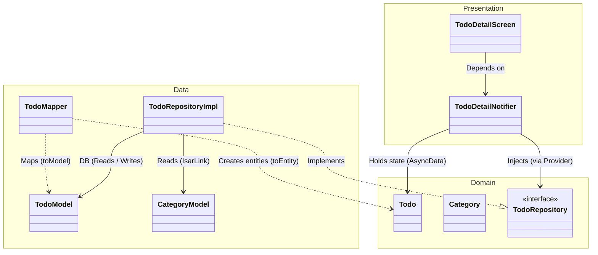
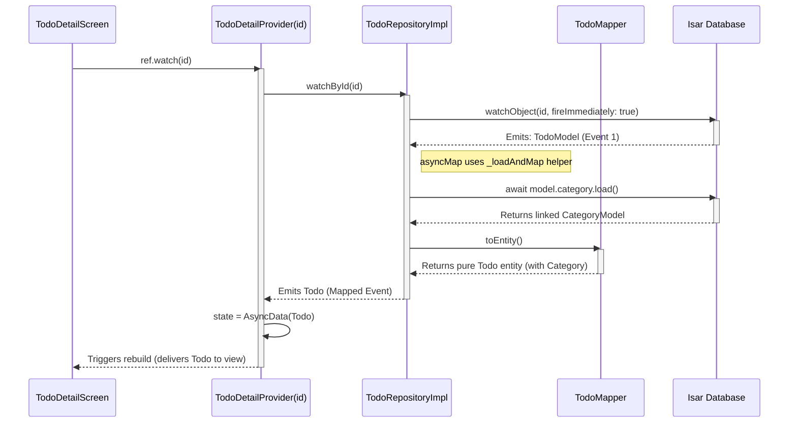

# 🚀 Flutter Riverpod + Isar Clean Architecture Boilerplate

A complete, modern starting point (boilerplate) for Flutter applications, designed for ultimate scalability. This project combines **Riverpod 3.x** for state management, the **Isar (Community)** local database, and strict **Clean Architecture** principles.

## ✨ Key Features

This application serves as a full-fledged testing ground for the implemented patterns. It includes:
- **Full CRUD** for tasks (Todo).
- **Relations (1:1 / N:1)**: Each task can have an associated *Category*.
- **Todo List**: A reactive list with checkboxes and Swipe-to-delete functionality.
- **Todo Detail Screen**: A standalone, independent view that subscribes to a specific resource by ID, protecting the application against memory leaks by leveraging Riverpod's `family` and `autoDispose`.
- **Settings Module**: Implementation of a global configuration layer (`ThemeMode`) backed by an Isar database singleton collection (`id=0`), reactively bound to the root `MaterialApp`.
- **Testability**: A comprehensive suite of unit tests (Notifiers) and UI tests (Widget Tests).
- **Visual Regression (Screenshot Testing)**: Implementation of Golden Tests to ensure pixel-perfect stability across the app UI.

## 🛠 Tech Stack

- **Framework**: [Flutter](https://flutter.dev/)
- **State Management**: [Riverpod 3.x](https://riverpod.dev/) (supported by `riverpod_generator` and `riverpod_annotation`)
- **Database**: [Isar Community](https://pub.dev/packages/isar_community) (provides support for the latest Riverpod generators)
- **Architecture**: Clean Architecture (Feature-First)
- **Testing**: `flutter_test`, `mocktail` (for repository mocking)
- **Misc**: `intl` for elegant date formatting (e.g., on the details screen).

---

## 📂 Project Structure (Feature-First)

The project is thematically divided by features. Each feature contains three independent layers with strictly defined dependency directions (Data & Presentation -> Domain).

```text
lib/
├── main.dart                    # Entry point (Isar.open + ProviderScope)
├── app.dart                     # MaterialApp configuration
├── core/
│   └── providers/               # Global providers (e.g., isar_provider.dart)
└── features/
    ├── todos/
    │   ├── domain/              # 1. DOMAIN LAYER (Independent)
    │   │   ├── entities/        # -> todo.dart, category.dart
    │   │   └── repositories/    # -> todo_repository.dart (interface)
    │   ├── data/                # 2. DATA LAYER (Dependent on external APIs/DBs)
    │   │   ├── models/          # -> todo_model.dart, category_model.dart (Isar)
    │   │   ├── mappers/         # -> todo_mapper.dart, category_mapper.dart
    │   │   └── repositories/    # -> todo_repository_impl.dart (Implementation)
    │   └── presentation/        # 3. PRESENTATION LAYER (UI + State Management)
    │       ├── providers/       # -> todo_notifier.dart, todo_detail_notifier.dart
    │       ├── screens/         # -> todo_screen.dart, todo_screen_detail.dart
    │       └── widgets/         # -> todo_list_item.dart, add_todo_fab.dart
    └── settings/
        ├── domain/              # -> user_preferences.dart + repository contract
        ├── data/                # -> Isar singleton model (id=0), mapper, repository
        └── presentation/        # -> settings notifier/provider and SettingsScreen
```

---

## 🏗 Architectural Craftsmanship

This boilerplate places maximum emphasis on **Dependency Inversion** and the predictability of behaviors during asynchronous I/O operations.

### Layer Separation (Class Diagram)

The lines indicate strict dependency directions. The Data and Presentation layers point towards the center (Domain), meaning database models can be swapped without affecting the business core.



### Reactivity and Single Source of Truth (Sequence Diagram)

Passing only the `ID` from the view and subscribing to the stream via a parameter (`.family`) guarantees a **Single Source of Truth** – the database (Isar) decides what state the screen should be in at any given moment. Mappers do not handle asynchronous queries; all I/O isolation logic resides entirely in the Repository's helper method.



### 🧠 Key Architectural Concepts:

1. **I/O Isolation Pattern (`_loadAndMap`)**: Mappers (e.g., `TodoMapper`), following best practices, remain fully **synchronous, stateless functions (extensions)**. The entire asynchronous burden of loading relations (e.g., `await model.category.load()`) falls exclusively on the Repository (using `asyncMap`). The mapper never executes I/O operations.
2. **Single Source of Truth via ID**: Layers exchange only the simplest identifiers (Int/String). Every new screen, component, or dialog fetches the latest data structure independently. This eliminates the risk of passing outdated snapshots through navigation parameters.
3. **AutoDispose and Resource Deallocation**: When the screen tied to a subscription is destroyed (e.g., the user taps *Back*), the `ref.onDispose` method kills the corresponding stream on the Isar database side, thereby conserving RAM.

---

## 🚀 Setup and Development

The original `isar` package has a conflict with `riverpod_generator`, which is why a community-maintained fork is used: `isar_community`. This requires us to use a specific generator.

```bash
# Install dependencies
flutter pub get

# Generate files (.g.dart, providers with riverpod_annotation)
dart run build_runner build --delete-conflicting-outputs

# Run on the selected device
flutter run
```

## 🧪 Verification

All core concepts are covered by comprehensive tests that verify behavior during asynchronous operations and Riverpod's lifecycle.

```bash
# Linter (Code Analysis)
flutter analyze

# Run the full test suite
flutter test
```

- **Notifier Tests (Unit)**: Validate handling of Loading / Retry states (throwing rejected Futures), intercept CRUD logic, and confirm subscription cancellation.
- **Widget Tests (UI)**: Dedicated, simulated resources using `async*` events are injected into the widgets to faithfully replicate the database's delay cycle (fixing potential `pumpAndSettle` pitfalls).
- **Golden Tests**: Verifies UI components pixel-by-pixel for Todo empty/populated states and the Settings screen, freezing viewport size, theme-related inputs, and deterministic fixture data.

## 🧭 Release Engineering & Git Automation

The repository includes [`scripts/create_atomic_history.sh`](scripts/create_atomic_history.sh), an advanced release-engineering utility for rebuilding the project history as a **Compile-Safe Commit Graph**.

Unlike a simple `git add` script, it evolves the codebase step by step:

- creates a minimal runnable Flutter skeleton before feature code appears,
- writes transitional Todo files without Category imports until the category relation is introduced,
- regenerates Riverpod and Isar `.g.dart` files in the same commits as their annotated sources,
- updates golden baselines when UI changes,
- restores the final Settings integration only at the end of the timeline.

Each generated commit uses Conventional Commits, explicit historical dates, and matching `GIT_AUTHOR_DATE`, `GIT_COMMITTER_DATE`, and `--date` values. The script also enforces a clean working tree before running, then executes code generation and tests at the relevant timeline points so that checking out any generated commit remains build-safe.
